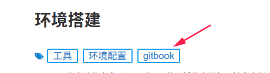

# gitbook常用插件
* "expandable-chapters-small": 目录折叠插件，直接配置可用
* "tags": 标签导航插件，有相关配置

# 1. sunlight-highlighter
Sunlight是一个上下文感知的客户端语法荧光笔。它作为一个很好的工作，可以突出显示代码，而不执行静态分析。
- 配置:

选项  | 默认 | 有效值 | 描述
-----|------|------|----
theme|"gitbook"|任何字符串|语法高亮主题。主题“gitbook”，“light”，“dark”与插件捆绑在一起
lineNumber|false|true or false|是否显示行号
lineNumberStart|1|任意非负数|第一行的行号，默认为1

```json 
    "plugins": [
        "-highlight", 
        "sunlight-highlighter"]
    "pluginsConfig": {
        "sunlight-highlighter": {
            "theme": "dark",
            "lineNumber": true
        }
    }
```
> #### Note::Note
>
> Content 


## 2. tags 标签
由于GitBook不支持本机功能，因此，如果tags: xxx在降价页面或YAML标题中，我现在创建此插件来创建标签。
#### 用法：
创建tags.md文件并将其放入SUMMARY.md

在根目录下创建一个命名为tags.md的文件，并将其放在SUMMARY.md文件的最后一个条目中。有效的SUMMARY.md是：
```
* [Introduction](README.md)
* [First Chapter](chapter1.md)
* [Tags](tags.md)
```
您可以将文件保留为tags.md空，或添加标题 # tags
#### 插件配置
```
{
  "plugins": [
    "tags"
  ],
  "pluginsConfig": {
        "tags": {
            "placement": "bottom"//标签的显示位置，top or bottom
        }
    }
}
```

####页面上添加
使用的时候只需要在页面上配置
```
tags: tag1, tag2, tag3 is here
```
####效果图




Define a variable `x` equal to 10.


var x =


var x = 10;


assert(x == 10);


// This is context code available everywhere
// The user will be able to evaluate `exposedVar`
var exposedVar = 3;
// ... or call `exposedFunction`
function exposedFunction {
    return 3;
}



## book.json配置案例
```json
"plugins": [
        "disqus",
        "-search",
        "search-pro",
        "github",
        "splitter",
        "sharing",
        "editlink",
        "image-captions"
        ],
    "pluginsConfig": {
        "search-pro": {
            "cutWordLib": "nodejieba",
            "defineWord" : ["Gitbook Use"]
        },
        "disqus": {
            "shortName": "gwebpack-handbook"
        },
        "github": {
            "url": "https://github.com/zerohyuan/notepad"
        },
        "sharing": {
            "weibo": true,
            "facebook": true,
            "twitter": true,
            "google": true,
            "instapaper": true,
            "vk": true,
            "all": [
                "facebook", "google", "twitter",
                    "weibo", "instapaper","vk"
            ]
        },
        "editlink": {
            "base": "https://github.com/zerohyuan/notepad/edit/master",
            "label": "编辑本页"
        }
    }
```

```js

function init(){

}
```